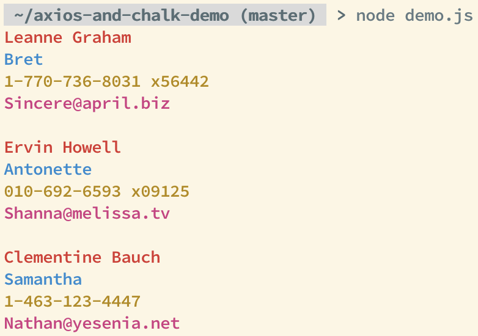

# `axios-and-chalk-demo`

To run this demo, execute the following:
```
$ git clone git@github.com:Hopding/axios-and-chalk-demo.git
$ cd axios-and-chalk-demo
$ npm install
$ node demo.js
```
This will generate the following output:


# Prerequisites

Note that you must have the following tools installed on your system to run this demo:

* [`git`](https://git-scm.com/downloads)
* [`node` and `npm`](https://nodejs.org/en/download/)
